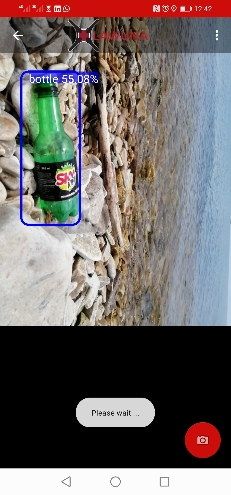

# Lawuna
> Open source project by Sodzo Foundation that focuses on detection of pollutants on the shores of fresh water bodies using realtime drone imagery.

## lawuna-Mobile-application
Application for detecting solid waste contaminants on the shores of fresh water bodies. This repository contains code for the mobile application version of this application and is currently only compatible with android.
