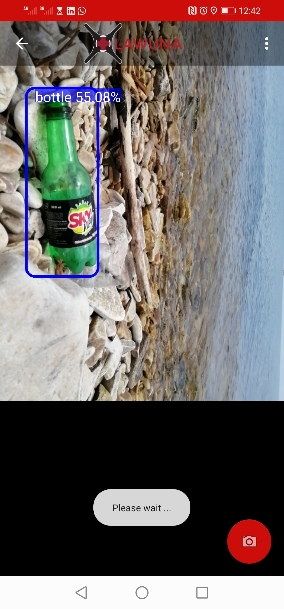

# Lawuna
> Open source project by Sodzo Foundation that focuses on detection of marco pollutants on the shores of fresh water bodies using realtime drone imagery.

## lawuna-Mobile-application
***

Is an android camera application for detecting macro contaminants (such as plastic bottles and polythene bags) along the shores of fresh water bodies using the device's back camera. With the help of a pre-trained YOLO v4 model trained on [MS COCO](https://cocodataset.org/) dataset that is retrained using transfer learning into a custom object detection model that is converted to [tensorFlow](https://www.tensorflow.org/) then quantized [tensorFlow lite](https://www.tensorflow.org/lite) format and uses data from a custom dataset of images collected from the shores of lake Victoria.

This repository walks you through how to setup and build the lawuna mobile application on your local machine.

Clone this repository, and build it using [android studio](https://developer.android.com/studio).
